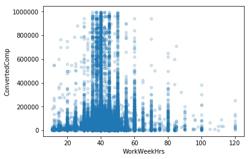
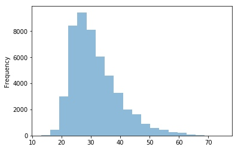
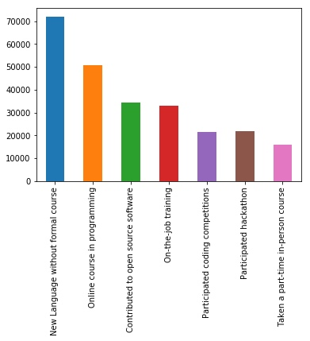

# 01D Stackoverflow Survey - Deploy

_*Series Content List*_
1. Business Understanding
2. Data Understanding
3. Prepare Data
4. Data Modeling
5. Evaluate the Results
6. **Deploy**

---

_*Index*_

[TOC]

---

## / functions
I got for some function to reuse when needed, here are some of it (this part should be in the Data Modeling part, but for this time my analysis is short, and with out any other machine learning useage, I cap it all in this post).

```python
# build function (base on solution2)
def check_sample(df):
    sample = df.sample(1)
    print('----checking sample index: {}'.format(sample.index[0]))
    ### sometimes pp is uncaptible with .format
    i = 1
    for (colname, coldata) in sample.iteritems():
        print('\n- columns #{} : {:-<8}'.format(i,colname))
        print(coldata.values)
        i += 1
    pp.pprint('----checking complete----')

### original from wrangle_test_full    
```

```python
# build function
def check_value(df,list):
    c = 1
    for i in list:
        print(('\n- columns #{} : {:-<8}'.format(c,i)))
        print((df[i].value_counts().nlargest(5)))
        ### nlargest 非常好用
        c += 1
    pp.pprint('----checking complete----')
```

```python
# build function
def check_detail(df,list):
    sampe = df.sample(1)
    c = 1
    for i in list:
        print(('\n- columns #{} : {:-<8}'.format(c,i)))
        pp.pprint(df[i].iloc[0])
        c += 1
        ## 使用 pprint 优化 dict 显示
```

```python
## build fuction
def drop_column(df,list):
    ## proceed
    dflen = len(df.columns)
    df.drop(list,axis=1,inplace=True)
    ### 在函数中要用 inplace=True 而不是赋值来作用于df
    ## check
    print('---- proceding ----')
    print('- drop {} columns: {} '.format(len(list), list))
    print('- remain {} columns'.format(len(df.columns)))
    print('- success : {}'.format(len(list) + len(df.columns) == dflen))
```

## / conclutions
Before conclution, there are EDA process, for testing what I am thinking of the data, for short, I will only show the conclution. All of my data and files can be found at github.

### // finding1 - Does work more time influence income?

- from chart above we can find:
    - people make most income from 35 - 50 hours per week
    - more work time do not get well paid
    - as for the less work hour time

### // finding2 - Are there many elder soft engineers?

- from chart above we can find:
    - people work as soft engineer when they graduated
    - mode around 28 years old
    - not more soft engineer over 40 years old

### // finding3 - How do you think of online education?

- from chart above we can find:
    - most of the candidate want to learn new language without formal course (maybe the time is so tight)
    - take a heckathon and a part-time in person are the smallest (maybe people not like tight goal for their spare time learning, or for a new language, these two are not the good perpose)

## / finish
For this project, I review many data analys skill and get some new try. Some are good, and some are failure. I am afrid I do not have time to complete all I thought at the begining.

But this is still a good start, maybe after my graduation from Udacity Data Scienst Nanodegree, I will write and publish more offten.

All of my code and data can be find at in my repo (for a subdir):